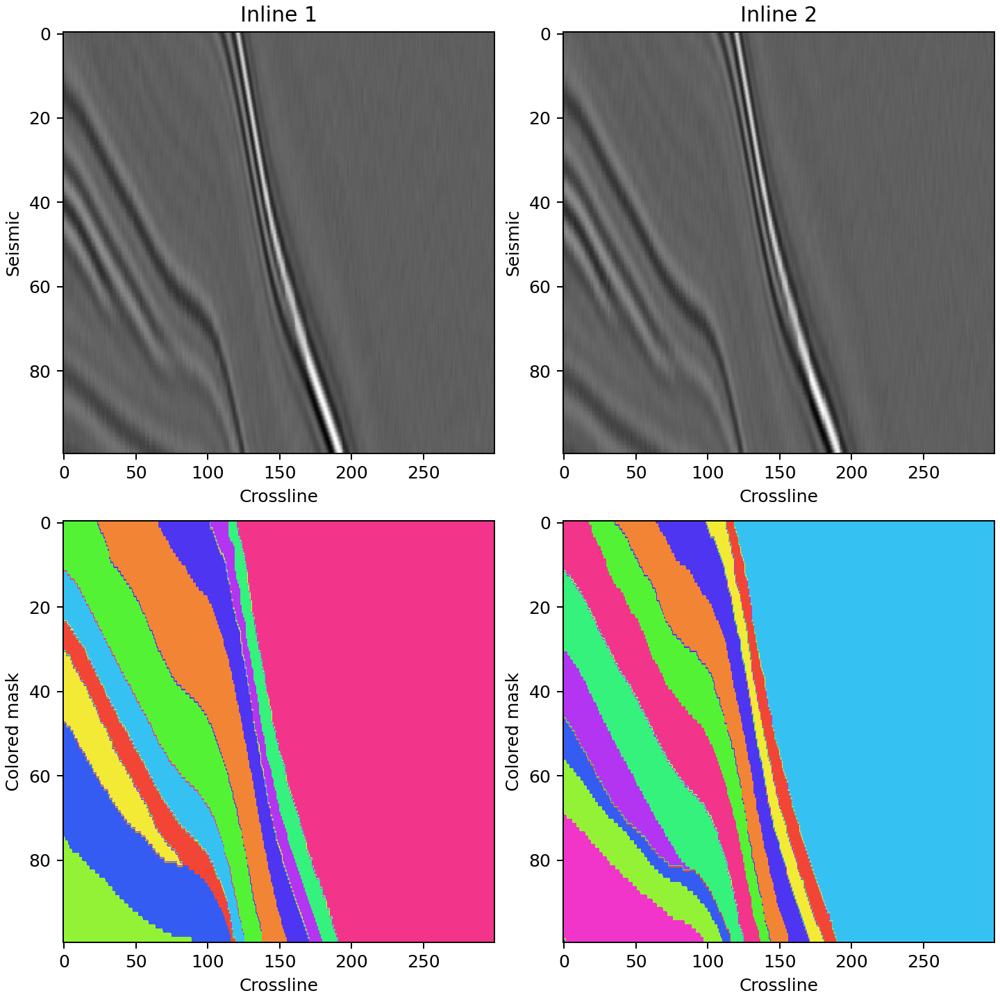

# 最小 SEG-Y 地层分割仓库

这个目录只保留推理闭环：读取 3-D 后叠加 `SGY/SEGY`，加载仓库
`models/` 中从 HPC 取回的三个 checkpoint，输出地层实例标签和彩色切片。
运行时不会联网下载模型。

## 权重目录

三个 HPC `best.pt` 约 1.3 GB，已通过 Git LFS 随发布仓库提供。使用
`git clone` 后权重目录如下；`--models-dir` 可以指定其他根目录：

```text
models/
├── segformer-base/
│   └── best.pt
├── segformer-refine/
│   └── best.pt
└── mask2former/
    └── best.pt
```

入口会检查 checkpoint 的阶段名称并严格加载全部参数，模型结构不匹配时会直接报错。

## 安装

先安装 Git LFS，再克隆仓库；不要只下载不包含 LFS 对象的源码压缩包：

```bash
git lfs install
git clone https://github.com/acse-ym722/seismic_surface_seg.git
cd seismic_surface_seg
```

建议使用 Python 3.10+ 和有 CUDA 的 PyTorch 环境：

```bash
python -m pip install -r minimal_sgy/requirements.txt
```

如果需要指定 CUDA 版 PyTorch，请先按
<https://pytorch.org/get-started/locally/> 安装匹配本机驱动的版本，再执行上面的命令。

## 一键运行

```bash
bash run.sh /path/to/input.sgy output/my_volume
```

脚本默认自动选择 GPU，完整运行：

```text
SGY → SegFormer Base → SegFormer Refine → Mask2Former
    → mask.npy + mask.sgy + confidence.npy + 彩色 PNG
```

主要产物：

- `mask.npy`：`[inline, xline, sample]` 的 `int16` 标签体；每张 inline
  内按从浅到深重新编号为 `0, 1, 2, ...`。
- `mask.sgy`：复制输入 SEG-Y 的文本头、二进制头和道头，只把每道振幅替换成
  mask 标签，便于地震软件直接加载。
- `overview.png`：从不同位置自动挑选的若干代表性彩色分割切片。
- `visualizations/*.png`：原始地震、彩色标签、叠加图和置信度。
- `summary.json`：输入几何、预处理、checkpoint、阈值和输出路径。

固定输入输出契约：

```text
输入:
  INPUT.sgy                     规则 3-D 后叠加 SEG-Y
  array convention             [inline, xline, sample]

输出目录:
  mask.npy                     int16 [inline, xline, sample]
  mask.sgy                     原文本头/二进制头/道头 + 标签道
  confidence.npy               float16 [inline, xline, sample]
  overview.png                 自动筛选的彩色切片总览
  visualizations/*.png         地震/标签/叠加/置信度
  summary.json                 几何、阈值、权重和产物元数据
```

也可以作为 Python API 调用：

```python
from minimal_sgy import run_inference

summary = run_inference(
    "minimal_sgy/example/sample.sgy",
    "output/demo",
    device="auto",
)
print(summary["artifacts"]["mask_npy"])
```

仓库自带两张 inline 的小型 SEG-Y，可直接验证安装、权重和输出：

```bash
bash run.sh minimal_sgy/example/sample.sgy output/demo
```

预期彩色效果：



只跑前两张 inline 做环境检查：

```bash
bash run.sh /path/to/input.sgy output/smoke \
  --max-inlines 2 --segformer-batch-size 2 --mask2former-batch-size 2
```

此时不会写不完整的 `mask.sgy`。CPU 也能运行，但 Mask2Former 会明显较慢：

```bash
bash run.sh /path/to/input.sgy output/cpu --device cpu
```

## 输入约束

- 支持规则的 3-D 后叠加 SEG-Y；默认读取道头字节 189/193 对应的
  `INLINE_3D/CROSSLINE_3D`。
- 不支持同一 inline/xline 有多道的叠前数据。
- 如果文件没有有效的 3-D 道头，可显式给 inline 数：

```bash
bash run.sh input.sgy output/result --inline-count 300
```

- `--amplitude-mode auto` 会在幅值尺度接近训练集时复用训练预处理，否则使用
  1%/99% 分位数做稳健缩放。需要严格复现实验预处理时传
  `--amplitude-mode training`。

RTX 4090 默认一次推理 4 张 Mask2Former 切片。如果显存不足，追加
`--mask2former-batch-size 1`；显存更大的卡可适当调高。

## 关于 Refine 先验

HPC 的 Refine 阶段训练时使用了无提示 SAM mask，但 `models/` 中没有 SAM
checkpoint。为了保证这个最小目录完全离线可运行，当前入口使用 Base
SegFormer 的预测作为 Refine 先验，并把该策略写入 `summary.json`。三个
HPC checkpoint 本身均严格加载；这个兼容策略可能造成相对原完整链路的精度下降。
